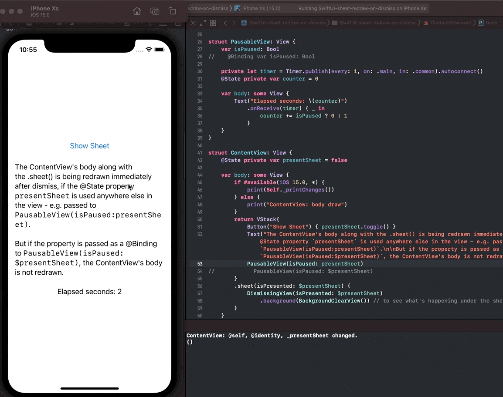
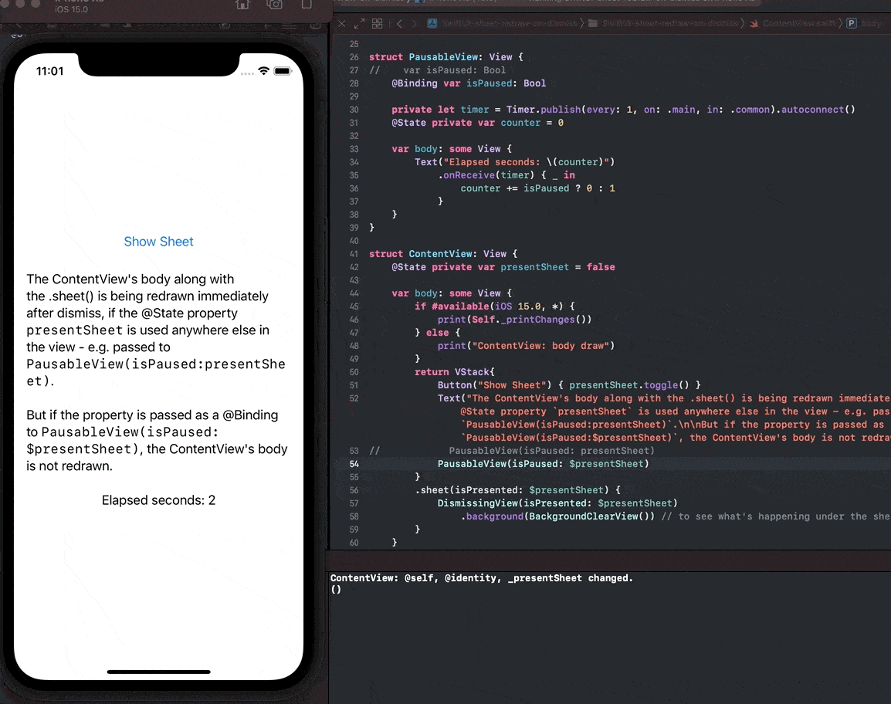

# SwiftUI body redraw with and without @Binding

## Use Case

If you have a `ContentView` that displays a pausable view based on a `@State private var presentSheet = false` property that is also used to present a `.sheet()`, if:

1. the property is sent to the `PausableView(isPaused: presentSheet)` as a normal property, the body of the ContentView and **of the sheet** is being redrawn when the sheet is dismissed
2. the property is sent to the `PausableView(isPaused: $presentSheet)` as a @Binding, the body of the ContentView and **of the sheet** is NOT redrawn when the sheet is dismissed

1 - Body gets redrawn when using a normal property:

See lines 27-28 and 53-54.



2 - Body is NOT redrawn when using a @Binding:

See lines 27-28 and 53-54.



## Is this normal behavior?

The ContentView body makes sense to change, but **is the sheet's body also supposed to be redrawn, since the sheet is not presenting anymore after dismiss?** 

I tried this on Xcode 13 and noticed the same behavior on iOS 14 and iOS 15.

The relevant code is in [ContentView.swift](https://github.com/clns/SwiftUI-sheet-redraw-on-dismiss/blob/main/SwiftUI-sheet-redraw-on-dismiss/ContentView.swift):

```swift
import SwiftUI

struct DismissingView: View {
    @Binding var isPresented: Bool
    
    var body: some View {
        if #available(iOS 15.0, *) {
            print(Self._printChanges())
        } else {
            print("DismissingView: body draw")
        }
        return VStack {
            Button("Dismiss") { isPresented.toggle() }
            Text("Dismissing Sheet").padding()
        }.background(Color.white)
    }
}

struct PausableView: View {
    var isPaused: Bool
//    @Binding var isPaused: Bool
    
    private let timer = Timer.publish(every: 1, on: .main, in: .common).autoconnect()
    @State private var counter = 0
    
    var body: some View {
        Text("Elapsed seconds: \(counter)")
            .onReceive(timer) { _ in
                counter += isPaused ? 0 : 1
            }
    }
}

struct ContentView: View {
    @State private var presentSheet = false
    
    var body: some View {
        if #available(iOS 15.0, *) {
            print(Self._printChanges())
        } else {
            print("ContentView: body draw")
        }
        return VStack{
            Button("Show Sheet") { presentSheet.toggle() }
            Text("The ContentView's body along with the .sheet() is being redrawn immediately after dismiss, if the @State property `presentSheet` is used anywhere else in the view - e.g. passed to `PausableView(isPaused:presentSheet)`.\n\nBut if the property is passed as a @Binding to `PausableView(isPaused:$presentSheet)`, the ContentView's body is not redrawn.").padding()
            PausableView(isPaused: presentSheet)
//            PausableView(isPaused: $presentSheet)
        }
        .sheet(isPresented: $presentSheet) {
            DismissingView(isPresented: $presentSheet)
                .background(BackgroundClearView()) // to see what's happening under the sheet
        }
    }
}
```
